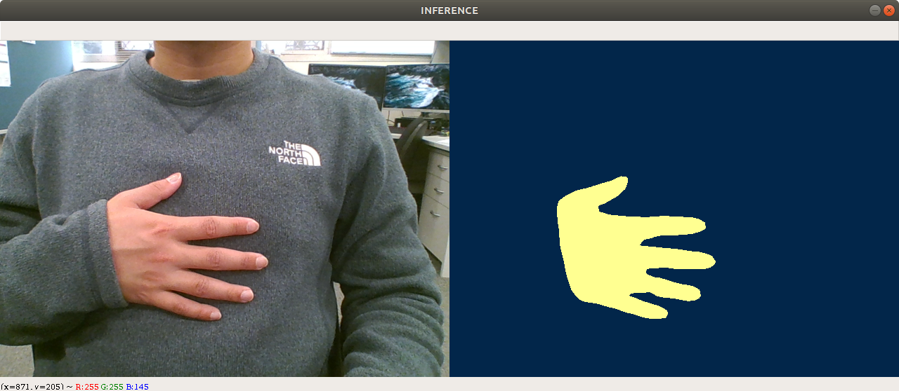

# Hand Segmentation in Third-Person Point of View
* The code is modified from [CSAILVision GitHub Repository](https://github.com/CSAILVision/semantic-segmentation-pytorch).
* [EgoHands](http://vision.soic.indiana.edu/projects/egohands/) dataset is utilised to train this neural network.
* GTX 1080 is used to train the network whereas the inference is running on GTX 1060.


## Network Architecture
Pyramid Scene Parsing Network (PSPNet) is implemented to train the model. This paper can be found in [this link](https://arxiv.org/abs/1612.01105).

## Pretrained Model
Download the pretrained model from [Google Drive](https://drive.google.com/drive/u/1/folders/1q--u3g9XgQ0qH1I6JJfCs3EfTMc3t1IT) and place the model in ```ckpt/egohands-resnet50dilated-ppm_deepsup```
## Quick Start: Running Inference
1. Simple Demo
```bash
python3 run_inference.py --cfg config/egohands-resnet50dilated-ppm_deepsup.yaml --visualise
```
2. To change resolution
```bash
python3 run_inference.py --cfg config/egohands-resnet50dilated-ppm_deepsup.yaml \
                         --resolution 720p --visualise
```
## Offline Testing
1. Generate an annotation file
```bash
python3 generate_odgt.py --folder [FOLDER] --out testing.odgt
```
2. To test on a folder of images
```bash
python3 test.py --cfg config/egohands-resnet50dilated-ppm_deepsup.yaml
```
## lib.segmentation package
**lib.segmentation.module_init(*cfg*)** \
**Parameters:** \
**cfg** (*class 'yacs.config.CfgNode'*) – configuration file \
**Returns:** \
**segmentation_module** (*class 'models.models.SegmentationModule'*) – segmentation module

**lib.segmentation.hand_segmentation(*frame, segmentation_module, save*)**\
**Parameters:** \
**frame** (*numpy.ndarray*) – Input frame \
**segmentation_module** (*class 'models.models.SegmentationModule'*) – segmentation module \
**save** (*boolean*) – a flag to save the numpy array \
**Returns:** \
**pred** (*numpy.ndarray*) – prediction 
